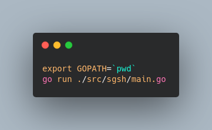
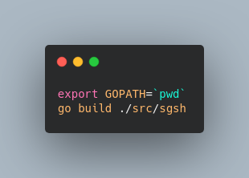

# Simple Go SHell

   

A simple shell developed in Golang.
Inspired by Stephen Brennan's [Write a shell in C](https://brennan.io/2015/01/16/write-a-shell-in-c/).

## Todos

- [x] Parsing a .profile, .rc file in order to load environment variables.
- [x] Evaluate environment variables when passed as arguments in commands.
- [x] Implement pipes => |
- [x] Implement chains => &
- [ ] Handle `` when parsing files, commands.

## Demo

## How to run/build

### Run

### Build

